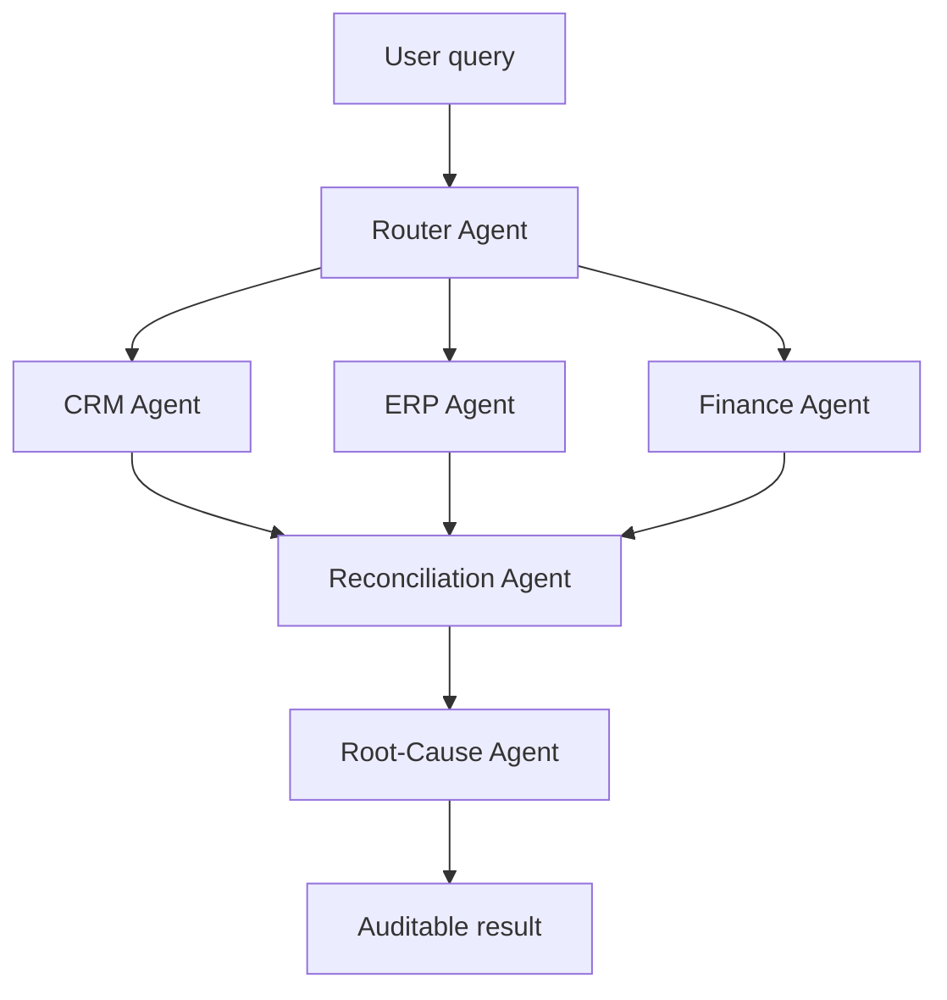

# AuditFlow

Traceable multi-agent financial reconciliation across CRM, ERP, and Finance systems, built on Band.

## Overview

AuditFlow addresses a common enterprise audit problem: the same transaction can appear differently across CRM, ERP, and Finance systems. Contract amounts, invoice IDs, payment amounts, currencies, fees, and entity names may not line up cleanly, and manual reconciliation is slow, brittle, and hard to audit after the fact.

The project uses six specialized agents to turn that process into a traceable workflow. Each agent owns one bounded responsibility: routing, CRM lookup, ERP lookup, Finance lookup, reconciliation, or root-cause analysis. This keeps system-specific business rules close to the data source and makes each handoff easy to inspect and debug.

Instead of producing a single opaque answer, AuditFlow records structured outputs, field-level discrepancies, root-cause classifications, and recommended actions. The result is a reconciliation flow that can explain whether a mismatch is normal, suspicious but explainable, or a true anomaly.

## Architecture

AuditFlow is organized as six agents across four layers:

- **Layer 1 - Router:** parses the natural-language query, classifies the intent, extracts entity and time scope, and dispatches work through Band @mentions.
- **Layer 2 - CRM / ERP / Finance Agents:** run in parallel, each reading its own mock system data and returning structured JSON plus relevant business rules.
- **Layer 3 - Reconciliation Agent:** aligns entities, compares CRM / ERP / Finance fields, and identifies field-level discrepancies.
- **Layer 4 - Root-Cause Agent:** applies business rules to classify findings as `normal`, `anomaly`, or `watch`, with confidence, risk level, evidence, and recommended actions.



## How Band Is Used

Band is the coordination layer, not just a wrapper around the agents. Each handoff between agents is represented as a real Band @mention in a shared room, so the collaboration history is visible and inspectable.

The agents discover and coordinate through the Band room. The Router sends work to the CRM, ERP, and Finance agents; their structured replies are correlated with a `query_id`; the Reconciliation Agent receives the collected evidence; and the Root-Cause Agent produces the final diagnosis. The `query_id` keeps parallel or repeated queries isolated from each other.

Because the full room conversation is preserved, the Band transcript itself becomes the audit log: who requested the check, which agents responded, what data was returned, and how the final conclusion was reached.

## Tech Stack

- **Agent framework:** Band SDK (`thenvoi`)
- **LLM:** OpenAI `gpt-4o-mini`
- **Backend bridge:** FastAPI
- **Frontend:** React + Vite

## Project Structure

```text
agents/       Six Band agents: router, CRM, ERP, Finance, reconciliation, and root-cause analysis
backend/      FastAPI bridge used by the frontend to create rooms, send queries, and assemble results
frontend/     React + Vite UI with Dashboard, Processing, and Results pages
data/         Mock CRM, ERP, and Finance datasets used by the agents and local validation
shared/       Shared schemas, trace helpers, and compatibility utilities
scripts/      Agent startup/shutdown scripts and validation scripts
docs/         Additional project notes and evaluation/proposal documents
```

## Getting Started

### Prerequisites

- Python 3.10 or newer
- Node.js 18 or newer
- A Band account with agent IDs and API keys for the six AuditFlow agents
- An OpenAI API key for the LLM-backed agent runtime

### Environment Variables

Copy the example environment file and fill in the Band credentials:

```bash
cp .env.example .env
```

The repository expects Band values such as:

```text
BAND_REST_URL
DEMO_USER_AGENT_ID
DEMO_USER_API_KEY
ROUTER_AGENT_ID / ROUTER_API_KEY
CRM_AGENT_ID / CRM_API_KEY
ERP_AGENT_ID / ERP_API_KEY
FINANCE_AGENT_ID / FINANCE_API_KEY
RECONCILIATION_AGENT_ID / RECONCILIATION_API_KEY
ROOTCAUSE_AGENT_ID / ROOTCAUSE_API_KEY
```

Also add your OpenAI key locally:

```text
OPENAI_API_KEY=your_value_here
```

Do not commit real API keys.

### Install Python Dependencies

The backend requirements are listed in `backend/requirements.txt`. The agents also import `thenvoi`, `pydantic-ai`, `python-dotenv`, and `openai`.

```bash
python3 -m venv .venv
source .venv/bin/activate
pip install -r backend/requirements.txt
pip install thenvoi pydantic-ai python-dotenv openai
```

### Start the Agents

Start all six agents from the repository root:

```bash
./scripts/start_agents.sh
```

The script reads `.env`, starts each agent with `python3`, and writes process IDs and logs under `.pids/` and `.logs/`.

To stop them:

```bash
./scripts/stop_agents.sh
```

For development, the same agents can also be started manually in separate terminals:

```bash
python3 agents/system/crm_agent.py
python3 agents/system/erp_agent.py
python3 agents/system/finance_agent.py
python3 agents/reconciliation/agent.py
python3 agents/rootcause/agent.py
python3 agents/router/agent.py
```

### Start the Backend

From the repository root:

```bash
uvicorn backend.app:app --reload --port 8000
```

### Start the Frontend

```bash
cd frontend
npm install
npm run dev
```

The Vite development server will print the local frontend URL.

## Demo

- **Live demo (frontend):** https://audit-flow-agent.vercel.app/
- **Demo video:** https://youtu.be/f6CPnd6qg7I

The live demo is a static frontend deployment that uses preloaded mock scenarios to show the complete audit flow without requiring live Band or backend credentials. The real multi-agent collaboration flow is shown in the demo video and can be run locally with the agents, backend, and frontend above.

## Validated Scenarios

The mock data and reconciliation tests cover the following scenarios under clean single-run local validation:

- Clean full payment
- Installment payment
- Entity alias alignment
- Bank fee adjustment
- FX conversion
- Invoice ID mismatch
- Required field missing
- Amount mismatch
- FX converted amount mismatch

The broader mock dataset also includes tax deduction, customer ID mismatch, contract ID mismatch, payment-before-invoice, and other audit cases documented in `data/README.md`.

## Additional Documentation

- `data/README.md` describes the CRM, ERP, and Finance mock datasets and test cases.
- `agents/reconciliation/README.md` explains the local reconciliation logic and validation flow.
- `docs/` contains additional project notes. Some design and validation documents are in Chinese.
